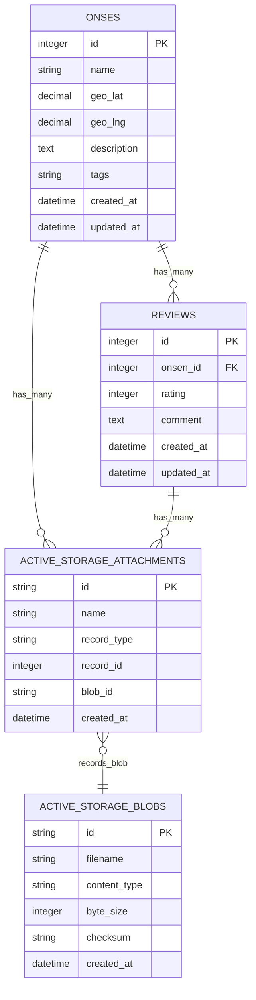

# システム設計書

## 1. コンテナ構成図

```
docker-compose.yml
├─ web : Rails + Puma + Tailwind + Hotwire
├─ sidekiq : 同イメージ, command: bundle exec sidekiq
├─ db : postgres:15-alpine
└─ redis : redis:7-alpine
```

## 2. ディレクトリ構成（抜粋）

```text
app/
├── controllers
│   ├── application_controller.rb
│   ├── onsens_controller.rb            # 公開側 (index, show)
│   ├── reviews_controller.rb
│   └── admin
│       └── onsens_controller.rb        # 管理 CRUD + CSV インポート (認証無し)
...
├── views
│   ├── admin
│   │   └── onsens                      # index.html.erb, new.html.erb, edit.html.erb, import.html.erb
│   └── onsens                          # 公開側ビュー
```

## 2.1 ディレクトリ構成 (詳細版)

```plaintext
.
├── Dockerfile
├── docker-compose.yml
├── .env.sample
├── Gemfile
├── Gemfile.lock
├── Rakefile
├── config
│ ├── application.rb
│ ├── boot.rb
│ ├── cable.yml
│ ├── credentials.yml.enc
│ ├── database.yml
│ ├── environment.rb
│ ├── environments
│ │ ├── development.rb
│ │ ├── production.rb
│ │ └── test.rb
│ ├── initializers
│ │ ├── active_storage.rb
│ │ ├── assets.rb
│ │ ├── backtrace_silencers.rb
│ │ ├── content_security_policy.rb
│ │ ├── cors.rb
│ │ ├── filter_parameter_logging.rb
│ │ ├── hotwire.rb
│ │ └── wrap_parameters.rb
│ ├── locales
│ │ └── ja.yml
│ └── routes.rb
├── app
│ ├── controllers
│ │ ├── application_controller.rb
│ │ ├── onsens_controller.rb # 公開側：index, show
│ │ ├── reviews_controller.rb # レビュー投稿
│ │ └── admin
│ │ └── onsens_controller.rb # 管理画面：CRUD + CSV インポート
│ ├── models
│ │ ├── onsen.rb
│ │ └── review.rb
│ ├── views
│ │ ├── layouts
│ │ │ ├── application.html.erb
│ │ │ └── \_navbar.html.erb
│ │ ├── onsens
│ │ │ ├── index.html.erb
│ │ │ ├── show.html.erb
│ │ │ ├── new.html.erb
│ │ │ ├── edit.html.erb
│ │ │ └── \_spot_card.html.erb
│ │ ├── reviews
│ │ │ └── \_form.html.erb
│ │ └── admin
│ │ └── onsens
│ │ ├── index.html.erb
│ │ ├── new.html.erb
│ │ ├── edit.html.erb
│ │ └── import.html.erb
│ ├── services
│ │ ├── csv_import_service.rb
│ │ └── map_service.rb # 住所 → 緯度経度変換 & 距離計算
│ ├── jobs
│ │ └── review_broadcast_job.rb
│ ├── javascript
│ │ └── controllers # Stimulus controllers
│ │ ├── application.js
│ │ ├── index.js
│ │ ├── spot_card_controller.js
│ │ └── modal_controller.js
│ └── assets
│ └── stylesheets
│ ├── application.tailwind.css
│ └── components.css
├── db
│ ├── migrate
│ │ ├── 20250xxxxx_create_onsens.rb
│ │ ├── 20250xxxxx_create_reviews.rb
│ │ ├── 20250xxxxx_create_active_storage_tables.rb
│ │ └── schema.rb
│ └── seeds.rb
├── lib
│ ├── tasks
│ │ └── csv_import.rake
│ └── map_utils.rb
├── log
│ ├── development.log
│ ├── production.log
│ └── test.log
├── tmp
│ ├── cache
│ └── pids
└── vendor
└── assets
└── images

```

## 2.2 ポイント解説

- **`app/controllers`**: メインの CRUD ロジックと Turbo Streams を担当。

- **`app/models`**: ドメインモデル。Active Storage の紐付けもここに定義。

- **`app/services`**: CSV インポートや地図関連ロジックを分離し、テスト容易性を向上。

- **`app/javascript/controllers`**: Stimulus コントローラ。spot_card や汎用 modal 用を配置。

- **`db/migrate`**: Active Storage 用マイグレーションも含む。

- **Docker まわり**: ルート直下に Dockerfile と docker-compose.yml で開発環境を完結。

## 3. ER 図



### 3.1 データモデル説明

- **Onsen と Review の関係**: 一対多（1:N）の関係。1 つの温泉（Onsen）に対して複数のレビュー（Review）が紐づく。

- **画像管理**: Rails 標準の Active Storage を採用し、`active_storage_attachments`と`active_storage_blobs`テーブルで画像を管理。

- **画像アップロード設定**: `Onsen`モデルと`Review`モデルの両方で`has_many_attached :images`を設定し、複数画像のアップロードに対応。

## 4. 主要クラス

| クラス                 | 主なメソッド / 責務                                                 |
| ---------------------- | ------------------------------------------------------------------- |
| **OnsensController**   | `index` 検索／フィルタ, `create`, `update`, `destroy`, `import_csv` |
| **CsvImportService**   | 行ごとに Onsen を生成、失敗行をログ収集                             |
| **MapService**         | `geocode(address)` / `distance_km(lat1,lng1,lat2,lng2)`             |
| **ReviewBroadcastJob** | 新規レビューを Turbo Stream で配信                                  |

## 5. 外部サービス

| サービス                   | 用途                 |
| -------------------------- | -------------------- |
| Google Maps JavaScript API | 地図表示             |
| Google Geocoding API       | 住所 → 緯度経度      |
| Amazon S3                  | 画像ストレージ       |
| Redis                      | Sidekiq ジョブキュー |

---
