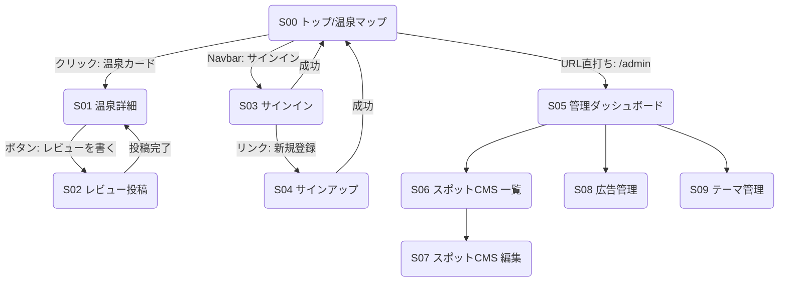

# 松江市温泉マップ  UI 仕様書

## 0. 目的

要件定義で確定した機能要件を満たしつつ、再利用可能なデザインシステムを構築する。ここでは主要画面の遷移・レイアウト構造・コンポーネント仕様を示す。

---

## 1. 画面一覧（ID 付き）

| ID      | 画面名                   | URL（Next.js ルーティング案） | 主コンポーネント                                                                 |
| ------- | ------------------------ | ----------------------------- | -------------------------------------------------------------------------------- |
| **S00** | トップ／温泉マップ       | `/`                           | MapView, SpotCardList, Header, Footer, BannerAd                                  |
| **S01** | 温泉詳細                 | `/onsen/[id]`                 | SpotHeader, ImageCarousel, SpotInfoTabs, ReviewList, WriteReviewButton, BannerAd |
| **S02** | レビュー投稿モーダル     | `modal:/onsen/[id]/review`    | StarRatingInput, TextArea, ImageUpload, SubmitBtn                                |
| **S03** | サインイン               | `/auth/signin`                | OAuthButtons, EmailForm                                                          |
| **S04** | サインアップ             | `/auth/signup`                | EmailForm, PasswordPolicyTip                                                     |
| **S05** | 管理ダッシュボード       | `/admin`                      | NavSidebar, StatsCards, ThemeSwitcher                                            |
| **S06** | スポット CMS (一覧)      | `/admin/spots`                | DataTable, FilterBar, CSVImportBtn                                               |
| **S07** | スポット CMS (詳細/編集) | `/admin/spots/[id]`           | FormSections, MapPicker                                                          |
| **S08** | 広告管理                 | `/admin/ads`                  | BannerPreviewGrid, SchedulePicker                                                |
| **S09** | テーマ管理               | `/admin/themes`               | ThemeCardGrid, DuplicateBtn                                                      |

---

## 2. 画面遷移図（Mermaid フローチャート）



> **遷移ルール**
>
> - 管理画面系(S05-S09)は `role === 'admin'` のみアクセス可。
> - レビュー投稿(S02)は `auth.required`。未ログイン時は S03 へリダイレクト。

---

## 3. ワイヤーフレーム（主要画面）

下記は低忠実度（Lo‑Fi）ワイヤーフレームのテキスト版。Figma ファイルは次フェーズで作成予定。

### 3.1 S00 トップ／温泉マップ

```
+------------------------------------------------------+
| Header (ロゴ｜ナビ｜SignIn Btn)                     |
+----------------------+-------------------------------+
| MapView (左 60%)      | SpotCardList (右 40%)          |
|  - GoogleMap Embed    |  - Card: サムネ/名前/評価     |
|  - Marker clustered   |  - Infinite scroll           |
+----------------------+-------------------------------+
| BannerAd (フッター直上, 横長)                        |
+------------------------------------------------------+
| Footer (リンク/著作権)                               |
+------------------------------------------------------+
```

### 3.2 S01 温泉詳細

```
Header 共通
-------------------------------------------------------
ImageCarousel (横スワイプ)
-------------------------------------------------------
SpotHeader: 温泉名 ★4.2 [レビュー数]
Tabs: [概要] [写真] [レビュー]
-------------------------------------------------------
TabContent (選択中)
-------------------------------------------------------
Button: 「レビューを書く」（固定CTA）
BannerAd (本文下)
-------------------------------------------------------
Footer 共通
```

### 3.3 S05 管理ダッシュボード

```
+------------------------------------------------------+
| NavSidebar | StatsCards (総スポット数 / レビュー数等) |
|            | QuickLinks (スポットCMS / 広告 / テーマ) |
+------------------------------------------------------+
```

> **アクセシビリティ指針**
>
> - コントラスト比 WCAG AA 準拠。
> - キーボード操作：全コンポーネントが `tabindex` 適切に設定。

---

## 4. コンポーネント設計 (Atomic Design)

| レイヤ        | 例                                             | 主な Props             |
| ------------- | ---------------------------------------------- | ---------------------- |
| **Atoms**     | Button, Icon, Badge, TextField                 | variant, size, onClick |
| **Molecules** | StarRatingInput, Card (SpotCard), OAuthButtons | rating, spotData       |
| **Organisms** | MapView, ReviewList, DataTable                 | spots\[], reviews\[]   |
| **Templates** | MapWithSidebarTemplate, AdminTemplate          | children               |
| **Pages**     | S00, S01 …                                     | params, session        |

Storybook を活用し、Props/Slots を UI ドキュメント化。

---

## 5. UX 原則 & デザインシステム

1. **モバイルファースト** – ビューポート幅 375px 基準。
2. **一貫性** – 色・間隔・タイポグラフィを Tailwind のカスタムテーマで統一。
3. **可発見性** – 温泉カード Hover で地図マーカーをバウンスさせ視覚リンク。
4. **フィードバック** – 投稿完了 トースト通知 + ページ内スムーズスクロール。
5. **パフォーマンス** – `next/image` + `loading="lazy"`、Map タイルは動的 import。

---

## 6. レスポンシブ・ブレイクポイント

| デバイス            | 主要レイアウト変更点                             |
| ------------------- | ------------------------------------------------ |
| ≤640px (mobile)     | SpotCardList は Drawer 下部表示、Map full‑screen |
| 641–1024px (tablet) | Map 50% / List 50% Split                         |
| ≥1025px (desktop)   | Map 60% / List 40% Split                         |

---

## 7. デザインシステム（Figma Hi‑Fi）

Figma では以下の 3 ファイル構成で運用します。

| ファイル                | 目的                                       | 主なページ・フレーム                                              |
| ----------------------- | ------------------------------------------ | ----------------------------------------------------------------- |
| **00_Design System**    | トークンとマスターコンポーネントを集中管理 | Color Styles / Type Styles / Icon Library / Components / Patterns |
| **01_Matsue Onsen App** | 画面デザイン／プロトタイプ                 | Flow Map / Mobile Screens / Tablet Screens / Desktop Screens      |
| **99_Playground**       | 試作や提案用のラフ                         | Ideation Frames / Alternate Layouts                               |

### 7.1 カラーパレット（Tailwind カスタム）

| Token         | Hex     | 用途                   |
| ------------- | ------- | ---------------------- |
| `primary-50`  | #EFF6FF | 背景（薄）             |
| `primary-100` | #DBEAFE | ホバー背景             |
| `primary-500` | #3B82F6 | アクション, CTA        |
| `primary-700` | #1D4ED8 | アクション Hover, Link |
| `accent-500`  | #F97316 | レビュー評価星, 強調   |
| `gray-900`    | #111827 | 見出し文字             |
| `gray-600`    | #4B5563 | 本文文字               |

> **WCAG**: 主要テキストはコントラスト比 4.5:1 以上を確保。

### 7.2 タイポグラフィスケール

| Style   | サイズ | 行間 | Weight | 用途             |
| ------- | ------ | ---- | ------ | ---------------- |
| H1      | 32     | 40   | 700    | 画面タイトル     |
| H2      | 24     | 32   | 700    | セクションヘッダ |
| Body    | 16     | 24   | 400    | 本文             |
| Caption | 12     | 16   | 400    | ラベル, 日付     |

フォントは **"Noto Sans JP"** を優先使用（可読性重視）。

### 7.3 ベースグリッド & スペーシング

- 4 px ベースグリッド。
- 主要スペーシングトークン：`spacing‑1 = 4px`, `spacing‑2 = 8px`, … `spacing‑6 = 24px`。
- Auto Layout を徹底し、左右パディングはモバイル `16px`, デスクトップ `24px`。

### 7.4 コンポーネント仕様（代表）

| 名称                | Variant                                    | Interaction                    |
| ------------------- | ------------------------------------------ | ------------------------------ |
| **Button**          | primary / secondary / ghost · sm / md / lg | Hover, Focus, Disabled         |
| **SpotCard**        | default / selected                         | Hover でマーカー連動ハイライト |
| **BannerAd**        | size‑md / size‑lg                          | Click → 外部 URL               |
| **StarRatingInput** | editable / readonly                        | Hover preview, Keyboard input  |
| **DataTable**       | sortable / selectable                      | Checkbox 行選択, Bulk actions  |

各コンポーネントは Auto Layout + Variants で構築し、Props を Storybook と同期。

### 7.5 アイコンセット

- **Lucide** アイコンをベースに 24 px グリッド。必要に応じてカスタム SVG を 2px ストロークで作成。

### 7.6 プロトタイピング規約

1. **Page flow**: `Prototype` タブで主要ユースケース（新規観光客の閲覧 → 詳細 → レビュー投稿）をリンク。
2. **Device Frames**: モバイルは iPhone 15, デスクトップは 1440 px。
3. **Animation**: Micro interaction はスマートアニメート 150 ms ease‑out。

### 7.7 アセットエクスポート

- 画像は `/public/images/` に最適化 WebP (75% 品質) で出力。
- アイコンフォントは省き、SVG スプライトを採用。

---
